Task 1

Созданные ВМ, вывел лейблы в outputs:
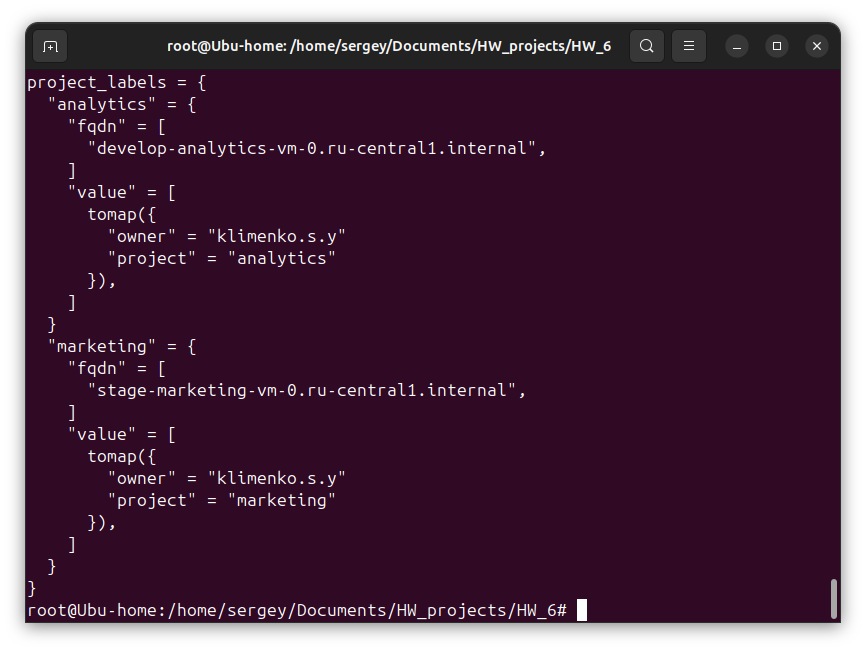

Скриншоты с выводом sudo nginx -t, лейблы и вывод в terraform console module.<имя_модуля>:

Marketing VM
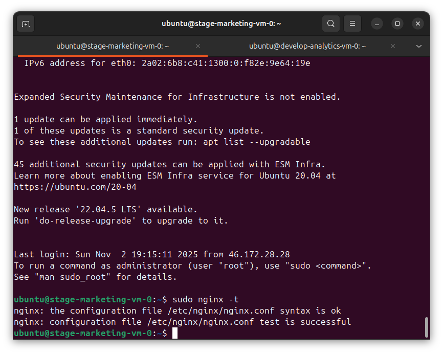

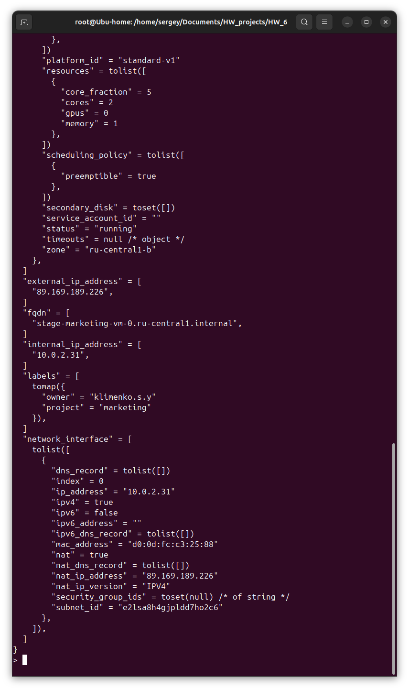

Analytics VM
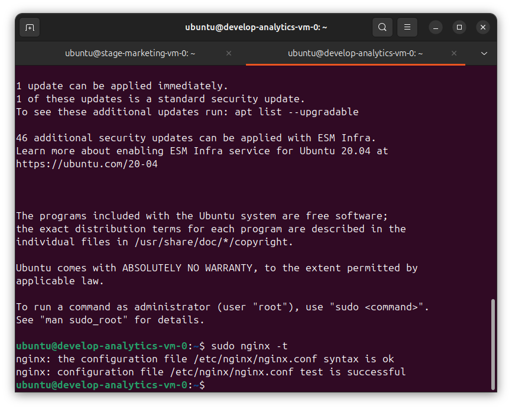
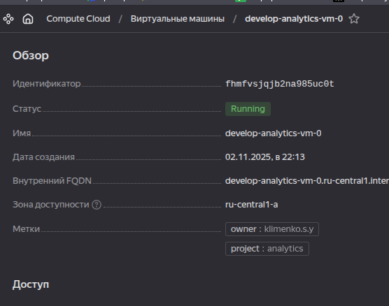
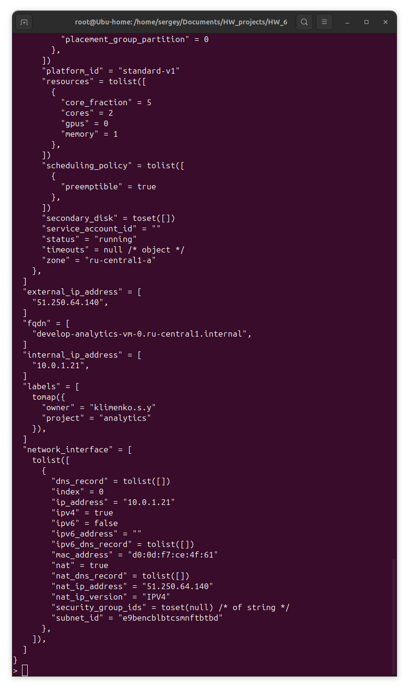

Task 2

Написал модуль по пути modules/vpc для создания сети и подсети, инициализировал и запустил код. Вывод module.vpc_dev в консоле на скрине ниже:
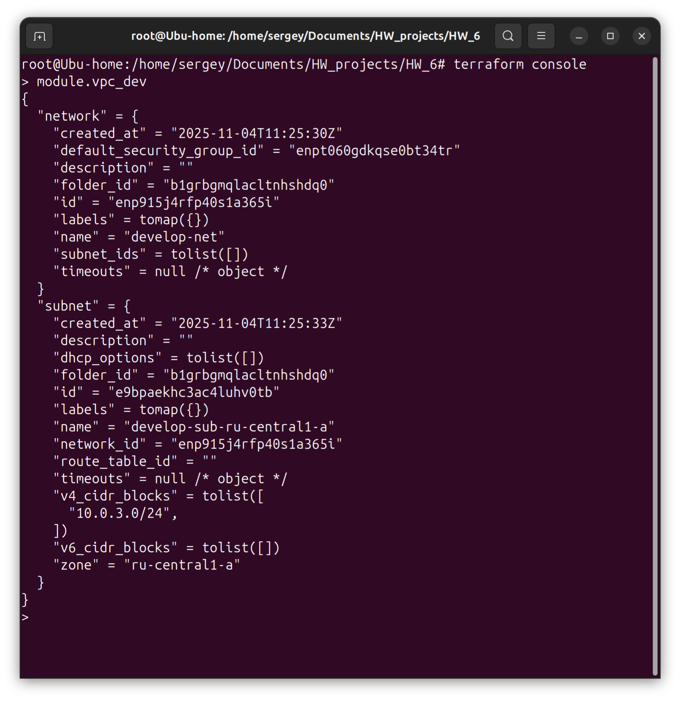

Сгенерировал документацию к модулю, файл README.md ([/home/sergey/Documents/HW_projects/HW_6/modules/vpc/README.md](modules/vpc/README.md)):
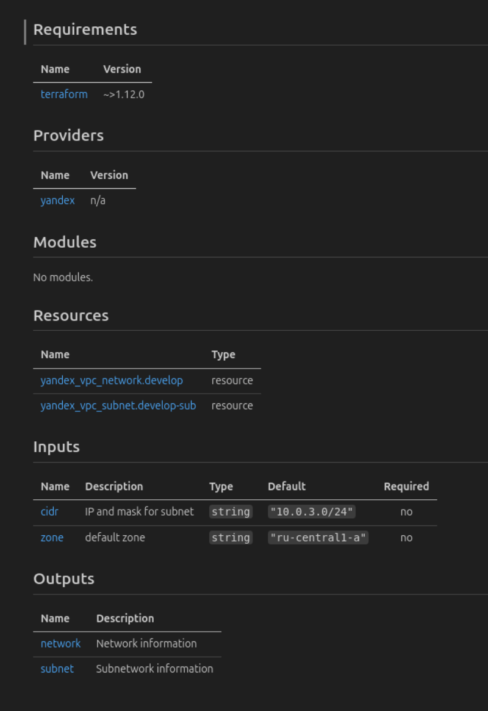

Task 3

Ресурсы в стейте:
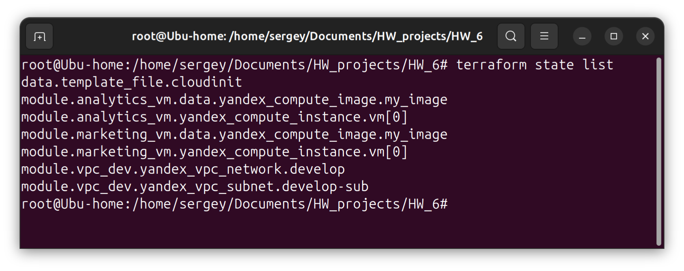

Удаляем модули:
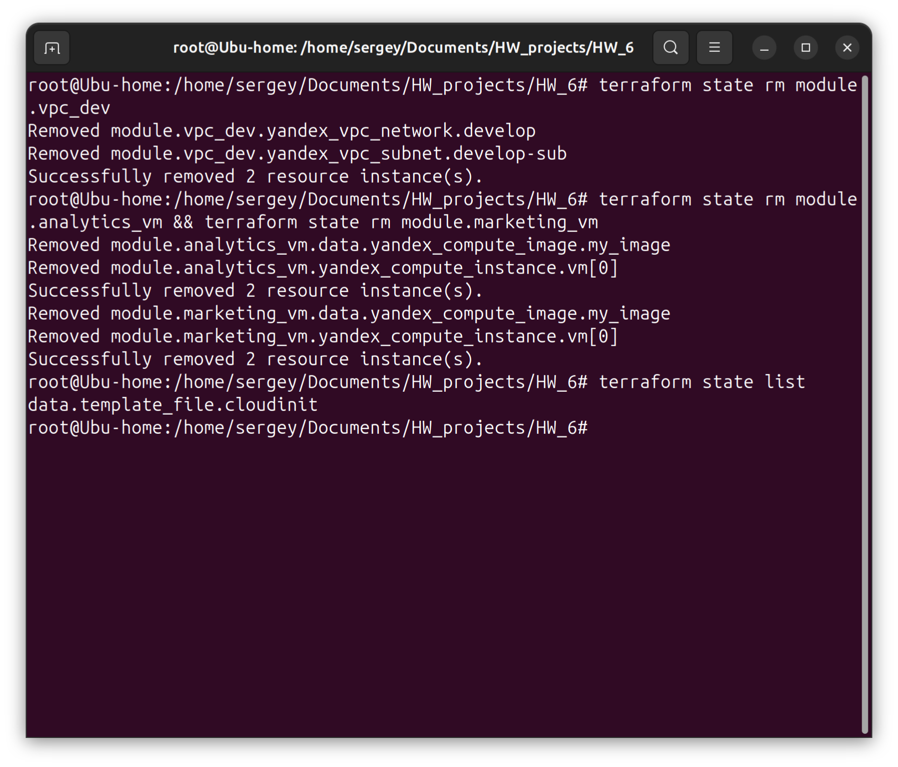

Импортируем обратно:

Network:
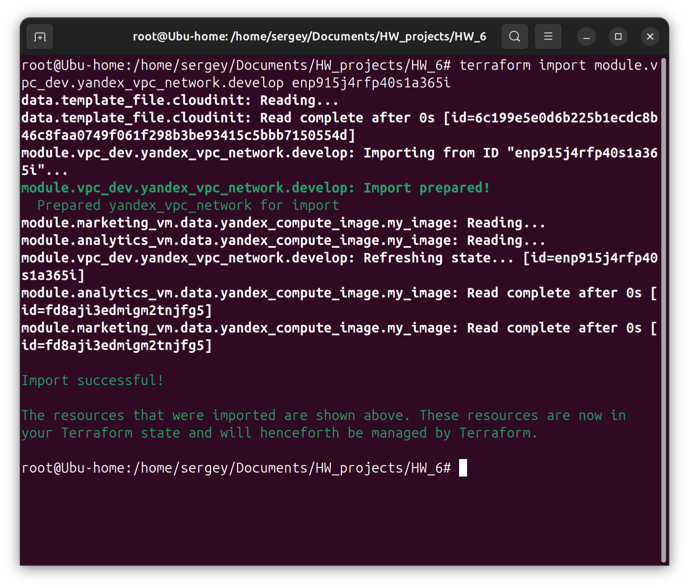

Subnet:
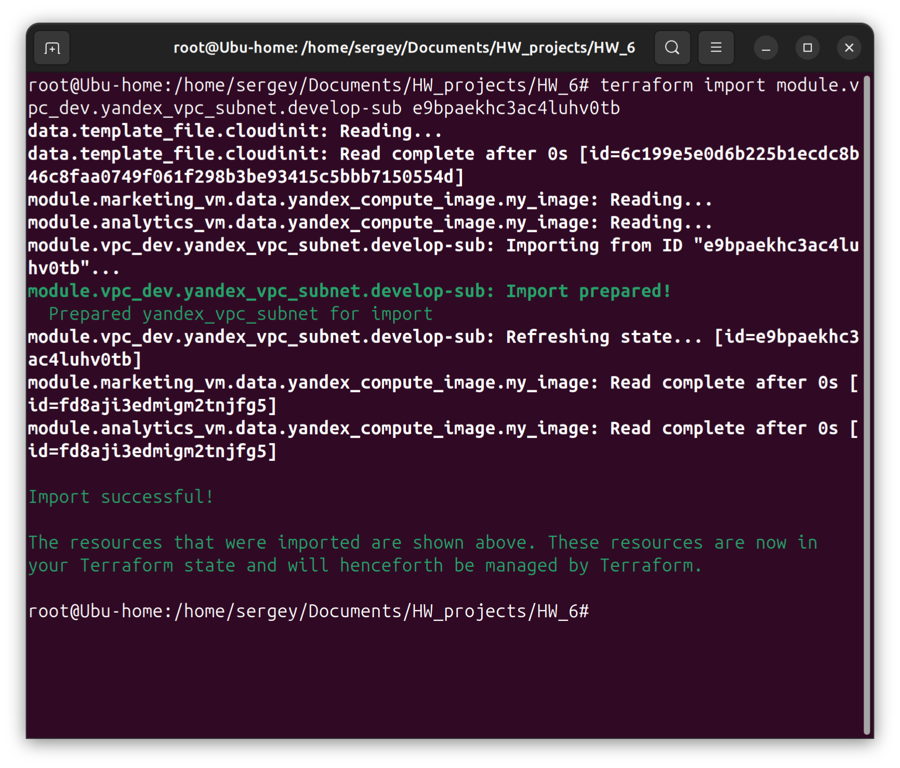

Marketing_vm:
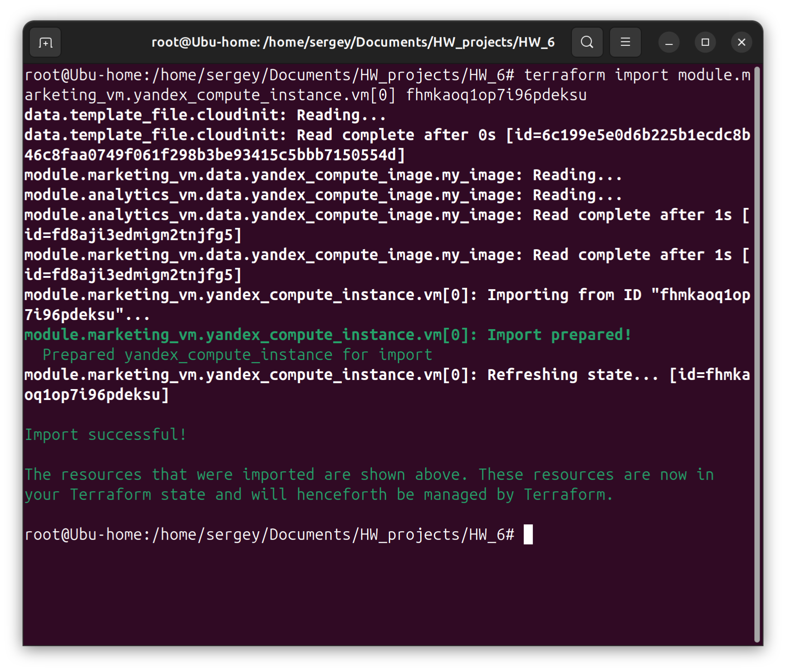

Analytics_vm:
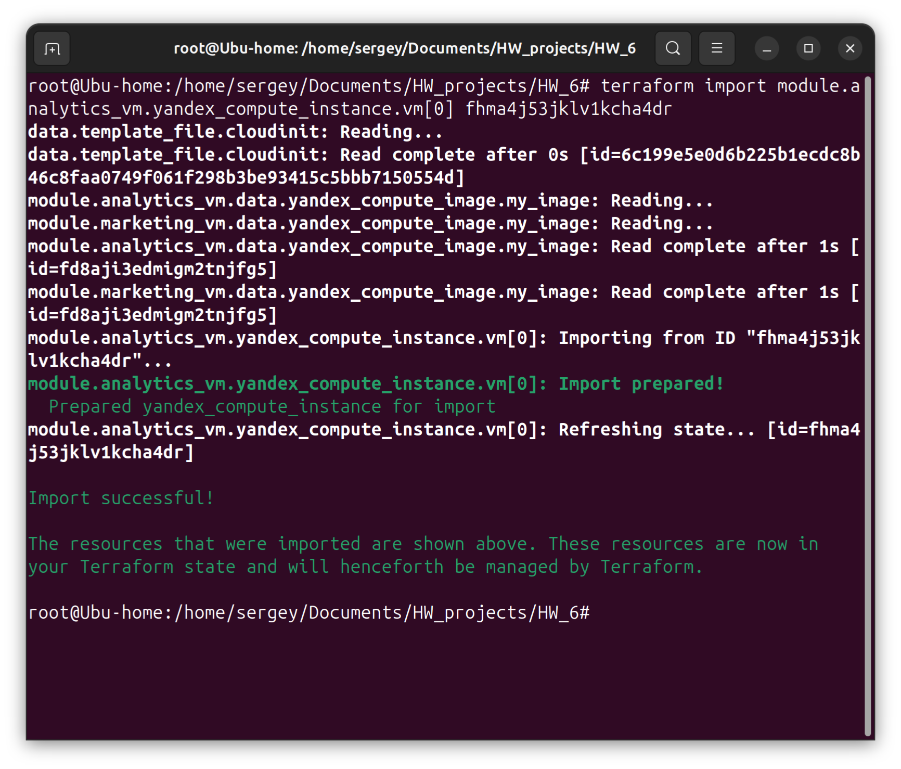

Финальный стейт-лист:
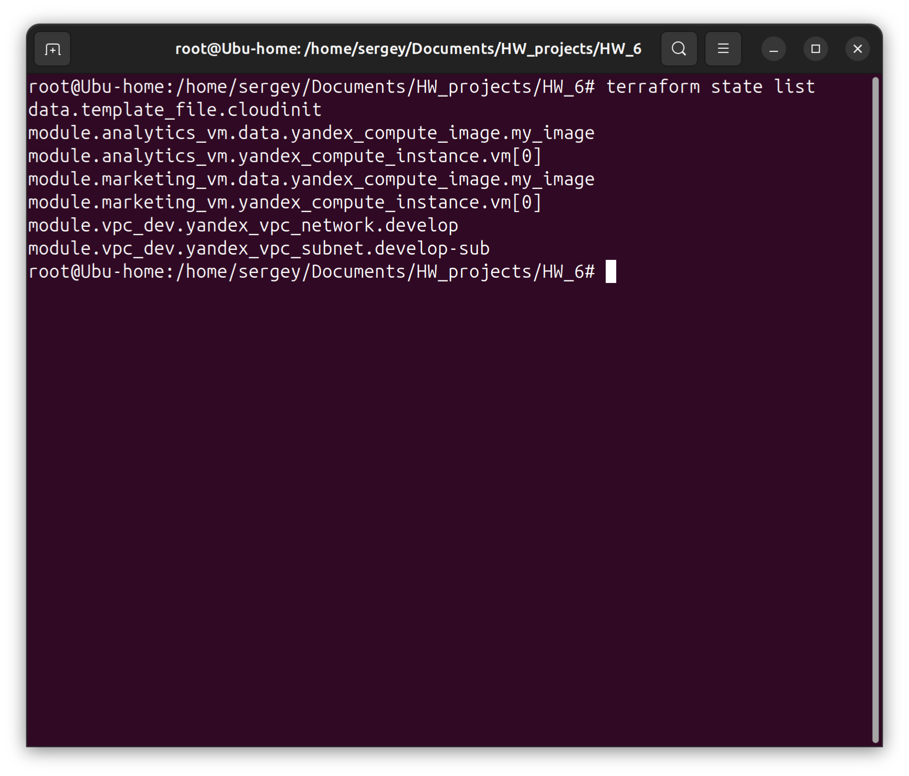

