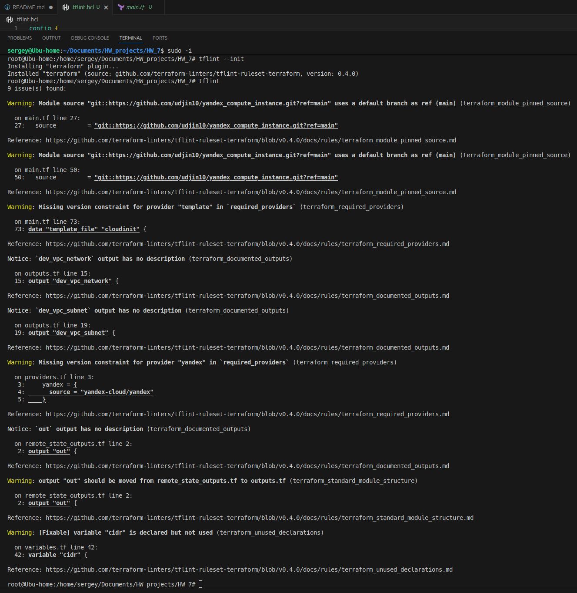
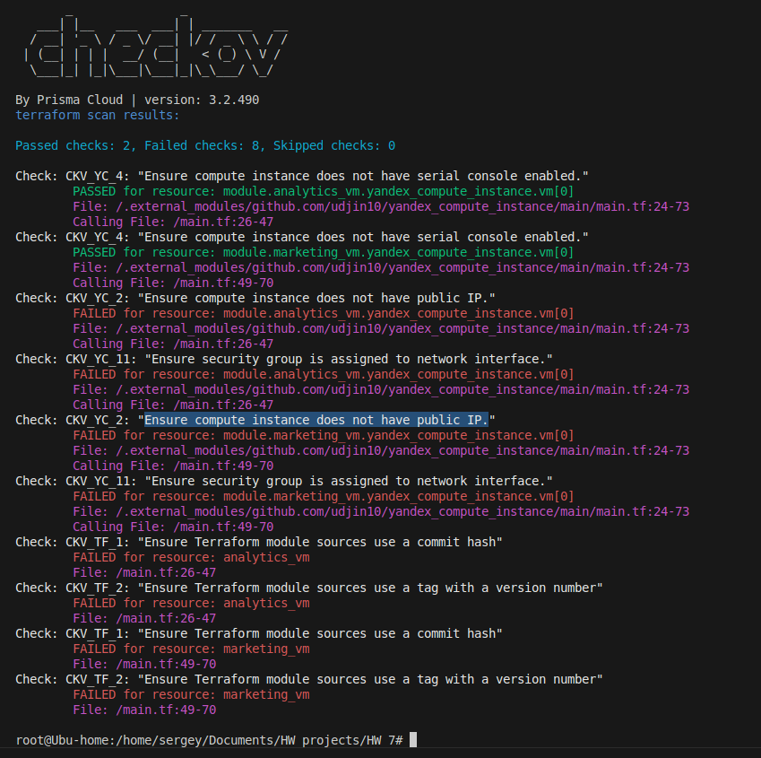
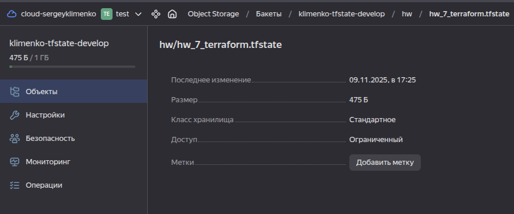
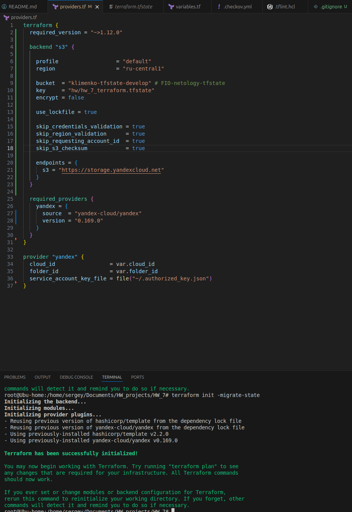
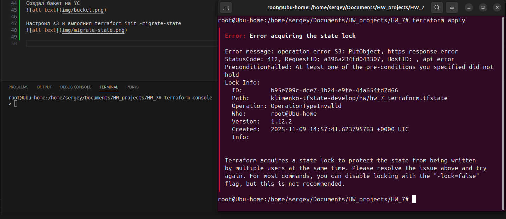
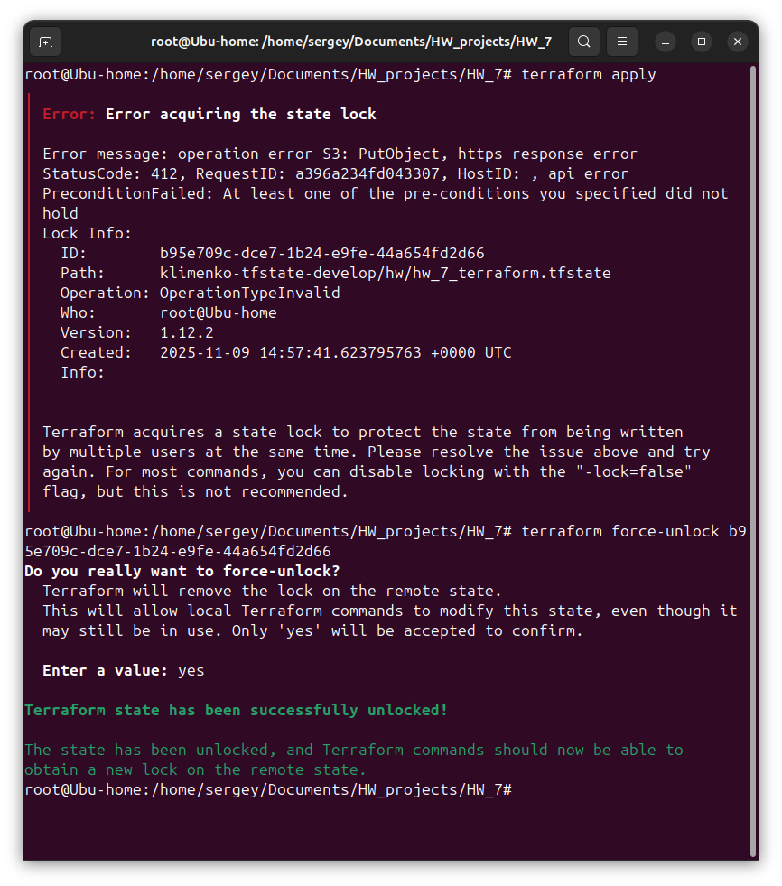

Задание 1

Возьмите код:

 - из ДЗ к лекции 4,
 - из демо к лекции 4.

    1. Проверьте код с помощью tflint и checkov. Вам не нужно инициализировать этот проект.
    2. Перечислите, какие типы ошибок обнаружены в проекте (без дублей).

Решение:

Проверка через tflint

Через checkov

tflint:
Из ошибок, в основном, это отсутствие указания версий в required_providers, но так же есть и неиспользуемые переменные.
Рекомендуют перенести вывод из remote_state_outputs.tf в outputs.tf

checkov:
 - У виртуальных машин есть публичные IP-адреса
 - Сетевые интерфейсы не привязаны к группам безопасности
 - Модули используют ветку main вместо конкретной версии

Задание 2

Возьмите ваш GitHub-репозиторий с выполненным ДЗ 4 в ветке 'terraform-04' и сделайте из него ветку 'terraform-05'.
Настройте remote state с встроенными блокировками:
Создайте S3 bucket в Yandex Cloud для хранения state (если еще не создан)
Создайте service account с правами на чтение/запись в bucket
Настройте backend в providers.tf с использованием нового механизма блокировок:

Выполните terraform init -migrate-state для миграции state в S3
Предоставьте скриншоты процесса настройки и миграции
Закоммитьте в ветку 'terraform-05' все изменения.
Откройте в проекте terraform console, а в другом окне из этой же директории попробуйте запустить terraform apply.
Пришлите ответ об ошибке доступа к state (блокировка должна сработать автоматически).
Принудительно разблокируйте state командой terraform force-unlock <LOCK_ID>. Пришлите команду и вывод.

Решение:

Создал бакет на YC

Настроил s3 и выполнил terraform init -migrate-state

Запуск terraform apply при включенной консоли:

Выполнил разблокировку:

Задание 3

Сделайте в GitHub из ветки 'terraform-05' новую ветку 'terraform-hotfix'.
Проверье код с помощью tflint и checkov, исправьте все предупреждения и ошибки в 'terraform-hotfix', сделайте коммит.
Откройте новый pull request 'terraform-hotfix' --> 'terraform-05'.
Вставьте в комментарий PR результат анализа tflint и checkov, план изменений инфраструктуры из вывода команды terraform plan.
Пришлите ссылку на PR для ревью. Вливать код в 'terraform-05' не нужно.

Ссылка на PR: https://github.com/Ervikson/klimenkosy_devops_HW_6/tree/terraform-hotfix
(Добавил отчеты в tflint, checkov и terraform-plan в PR в формате .txt)

Задание 4

Напишите переменные с валидацией и протестируйте их, заполнив default верными и неверными значениями. Предоставьте скриншоты проверок из terraform console.
type=string, description="ip-адрес" — проверка, что значение переменной содержит верный IP-адрес с помощью функций cidrhost() или regex(). Тесты: "192.168.0.1" и "1920.1680.0.1";
type=list(string), description="список ip-адресов" — проверка, что все адреса верны. Тесты: ["192.168.0.1", "1.1.1.1", "127.0.0.1"] и ["192.168.0.1", "1.1.1.1", "1270.0.0.1"].

Решение:
Валидные значения:
_valid.png)

Не валидные:
_invalid.png)
